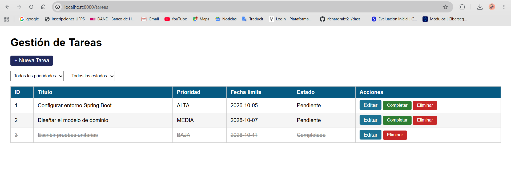
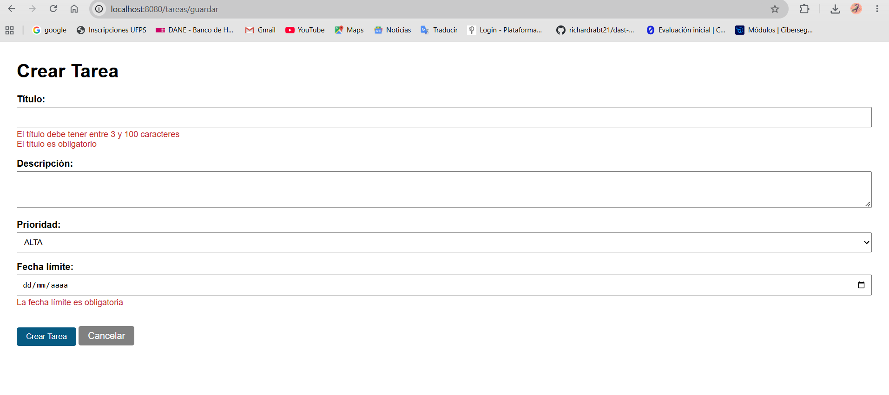
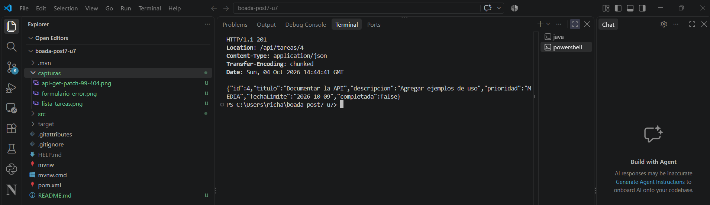
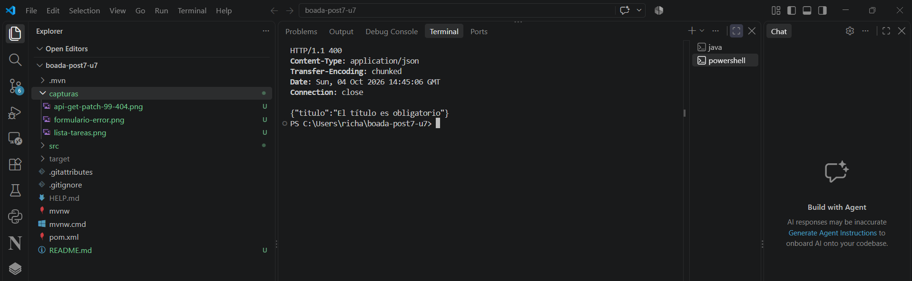

# Post-contenido — Unidad 7: Gestión de Tareas con Spring Boot

## Descripción

Repositorio del laboratorio de la Unidad 7 de Programación Web — Séptimo
Semestre. Un único proyecto Spring Boot con dos capas sobre el mismo
TareaService: una vista Thymeleaf (@Controller, parte 1) y una API REST
(@RestController, parte 2).

## Prerrequisitos

- JDK 17 o superior en el PATH.
- Apache Maven 3.8+ (o el wrapper `mvnw` incluido en el proyecto).
- Git.
- Navegador web y Postman o curl para probar la API.

## Estructura del proyecto

- `pom.xml`: un único proyecto Maven Spring Boot para ambas partes.
- `src/main/java/com/universidad/tareas/model`: `Tarea` y `Prioridad` (con Bean Validation).
- `src/main/java/com/universidad/tareas/service`: `TareaService` (repositorio en memoria).
- `src/main/java/com/universidad/tareas/controller`: `TareaController` (vista), `TareaApiController` (API) y `ApiErrorHandler`.
- `src/main/resources/templates/tareas`: plantillas `lista.html` y `formulario.html`.
- `capturas/`: capturas de pantalla de la vista web y de la API.

## Parte 1 — Vista Thymeleaf con @Controller

TareaController expone /tareas con filtrado por @RequestParam (prioridad,
completada), formularios validados con @Valid + BindingResult, y las
acciones completar/eliminar implementadas como POST (no GET) para no
introducir efectos secundarios en peticiones de solo lectura.

## Parte 2 — API REST con @RestController

TareaApiController expone /api/tareas con los verbos GET, POST, PUT,
PATCH y DELETE, inyectando por constructor la MISMA instancia de
TareaService que usa la Parte 1. ApiErrorHandler traduce los errores de
@Valid en JSON estructurado (400 Bad Request), en lugar de la pantalla
de error HTML por defecto de Spring Boot.

### Endpoints de la API

| Método | URL | Código éxito | Código error | Descripción |
|---|---|---|---|---|
| GET | /api/tareas | 200 OK | — | Lista de tareas en JSON, filtrable con ?prioridad= y/o ?completada=. |
| GET | /api/tareas/{id} | 200 OK | 404 Not Found | Retorna la tarea con el ID indicado. |
| POST | /api/tareas | 201 Created | 400 Bad Request | Crea una tarea con el JSON del body; 400 si falla la validación. |
| PUT | /api/tareas/{id} | 200 OK | 404 / 400 | Reemplaza todos los campos de la tarea existente. |
| PATCH | /api/tareas/{id}/completar | 200 OK | 404 Not Found | Actualización parcial: marca únicamente completada = true. |
| DELETE | /api/tareas/{id} | 204 No Content | 404 Not Found | Elimina la tarea con el ID indicado. |

## Decisiones de diseño

- Inyección por constructor (no @Autowired en campo) en ambos
  controladores: mejora la testabilidad y hace explícita la dependencia.
- @FutureOrPresent en lugar de @Future en fechaLimite: permite tareas
  con vencimiento el mismo día de su creación.
- POST (no GET) para completar/eliminar en TareaController: una petición
  GET debe ser segura y no debe modificar estado del servidor.
- PATCH (no PUT) para /api/tareas/{id}/completar: representa una
  actualización parcial de un único campo, no el reemplazo del recurso.
- Manejo de validación separado por capa: BindingResult para la vista
  HTML, @RestControllerAdvice para la API JSON — cada una responde en el
  formato que le corresponde.
- Persistencia en memoria (Map en TareaService) en lugar de JPA/Hibernate:
  la persistencia real se introduce formalmente en la Unidad 8.

## Cómo compilar y ejecutar

1. Clonar el repositorio: `git clone https://github.com/richardrabt21/boada-post7-u7.git`
2. Abrir la carpeta como proyecto Maven en el IDE (IntelliJ IDEA o VS Code).
3. Ejecutar `mvn spring-boot:run` (o `./mvnw spring-boot:run`).
4. Vista web: http://localhost:8080/tareas
   API REST: http://localhost:8080/api/tareas (probar con Postman o curl)

## Capturas de pantalla

